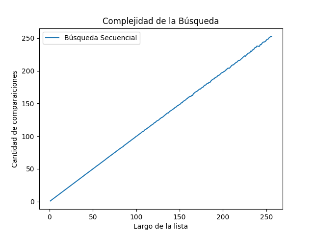

# 6.7 Gráficos de complejidad

## Contar la cantidad de operaciones de un algoritmo

La siguiente función realiza una búsqueda secuencial de un elemento en una lista. Devuelve la posición del elemento si lo encuentra y -1 si no lo encuentra.

```python
def busqueda_secuencial(lista, x):
    '''Si x está en la lista devuelve el índice de su primera aparición, 
    de lo contrario devuelve -1.
    '''
    pos = -1
    for i,z in enumerate(lista):
        if z == x:
            pos = i
            break
    return pos
```

Esta modificación de la función cuenta (y devuelve) además cuántas comparaciones (`z == x`) hace la función. Observá que devuelve un par de datos. 

```python
def busqueda_secuencial_(lista, x):
    '''Si x está en la lista devuelve el índice de su primera aparición, 
    de lo contrario devuelve -1. Además devuelve la cantidad de comparaciones
    que hace la función.
    '''
    comps = 0 # inicializo en cero la cantidad de comparaciones
    pos = -1
    for i,z in enumerate(lista):
        comps += 1 # sumo la comparación que estoy por hacer
        if z == x:
            pos = i
            break
    return pos, comps

```

Si querés acceder a la posición podés usar `busqueda_secuencial_(lista, x)[0]` y para acceder a la cantidad de comparaciones que hizo `busqueda_secuencial_(lista, x)[1]`.

### Ejercicio 6.19: Contar comparaciones en la búsqueda binaria
Modificá el código de búsqueda binaria (`busqueda_binaria(lista, x)`) introducido en la [Sección 6.5](../06_Organizacion_y_Complejidad/05_BusqBinaria.md#búsqueda-binaria), de forma que devuelva (además de la posición del elemento en la lista) la cantidad de comparaciones que realizó el algoritmo para encontrarlo o decidir que no está.

## Gráficar la cantidad de comparaciones promedio

La siguiente función `generar_lista(n, m)` devuelve una lista ordenada de `n` elementos diferentes entre `0` y `m-1`, mientras que `generar_elemento(m)` devuelve un elemento aleatorio en el mismo rango de valores.

```python
import random

def generar_lista(n, m):
    l = random.sample(range(m), k = n)
    l.sort()
    return l

def generar_elemento(m):
    return random.randint(0, m-1)
```

Dada una lista ya generada, digamos que un *experimento elemental* es generar un elemento, buscarlo en la lista y contar la cantidad de comparaciones realizadas. Esta cantidad de operaciones es el *resultado* del experimento elemental.

```python
m = 10000
n = 100
lista = generar_lista(n, m)

# acá comienza el experimento
x = generar_elemento(m)
comps = busqueda_secuencial_(lista, x)[1]
```

Entonces, el siguiente código da la cantidad de comparaciones *promedio* en `k` experimentos elementales. Observá que hay muchas variables diferentes dando vueltas: `n`, `m` y `k`.

```python
m = 10000
n = 100
k = 1000
lista = generar_lista(n, m)

def experimento_secuencial_promedio(lista, m, k):
    comps_tot = 0
    for i in range(k):
        x = generar_elemento(m)
        comps_tot += busqueda_secuencial_(lista,x)[1]

    comps_prom = comps_tot / k
    return comps_prom
```

Como las listas tienen `n = 100` elementos y estoy buscando un número cualquiera entre `m` números diferentes, es casi seguro que no lo voy a encontrar y que voy a tener que recorrer toda la lista para concluir esto (aunque en algún caso puede ser que esté y lo encuentre antes de recorrerla toda!). Entonces el promedio de comparaciones va a dar cercano al largo `n` de la lista, quizás un poco menor. Tiene una componente  aleatoria, es un *experimento* numérico.

Si decíamos que buscar un elemento era un *experimento elemental* digamos que repetir *k* experimentos elementales y calcular el promedio de comparaciones es un *experimento de promedios*.

Grafiquemos los resultados de estos *experimentos de promedios* para diferentes listas de largos `n` entre 1 y 256. Es decir, estaremos graficando la cantidad de comparaciones que hace en promedio el algoritmo de búsqueda secuencial sobre una lista de largo `n`, para diferentes valores de `n`.

```python
import matplotlib.pyplot as plt
import numpy as np

m = 10000
k = 1000

largos = np.arange(256) + 1 # estos son los largos de listas que voy a usar
comps_promedio = np.zeros(256) # aca guardo el promedio de comparaciones sobre una lista de largo i, para i entre 1 y 256.

for i, n in enumerate(largos):
    lista = generar_lista(n, m) # genero lista de largo n
    comps_promedio[i] = experimento_secuencial_promedio(lista, m, k)

# ahora grafico largos de listas contra operaciones promedio de búsqueda.
plt.plot(largos,comps_promedio,label = 'Búsqueda Secuencial')
plt.xlabel("Largo de la lista")
plt.ylabel("Cantidad de comparaciones")
plt.title("Complejidad de la Búsqueda")
plt.legend()
plt.show()
```



En la próxima clase estudiaremos en detalle la librería `matplotlib` que ya empezamos a usar la clase pasada. Por ahora solo agregamos la función `plot(x, y)` a la que se le pasan dos vectores (o listas) `x` e `y` y realiza una gráfico de líneas uniendo los puntos con esas coordenadas. El parámetro `label` permite ponerle un nombre a la curva que se muestra luego con la función `plt.legend()`.

Este gráfico parece medio sonso, pero en el próximo ejercicio va a ir tomando color.

### Ejercicio 6.20: Búsqueda binaria vs. búsqueda secuencial
En este Ejercicio vamos a rehacer los gráficos del ejemplo anterior, pero primero cambiando el algoritmo de búsqueda y luego comparando ambos algoritmos.

1. Usando `experimento_secuencial_promedio(lista, m, k)` como base, escribí una función `experimento_binario_promedio(lista, m, k)` que cuente la cantidad de comparaciones que realiza en promedio (entre `k` experimentos elementales) la búsqueda binaria sobre la lista pasada como parámetro.
2. Graficá los resultados de estos experimentos para listas de largo entre 1 y 256.
3. Graficá ambas curvas en una misma figura, nombrando adecuadamente las curvas, los ejes y la figura completa. Jugá con `xlim` e `ylim` para visualizar bien las dos curvas, aunque tengas que restringir el rango.
4. ¿Qué observas en estos gráficos? ¿Qué podés decir sobre la complejidad de cada algoritmo? ¿Son similares?

El código de este ejercicio guardalo en `plot_bbin_vs_bsec.py`.


